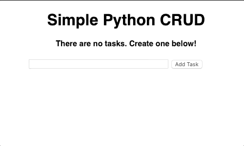

# Python Simple CRUD Application
Simple CRUD Application using one of Python's Web Development Framework - Flask. Tutorial on this application build was posted by FreeCodeCamp. 

Feel free to check out the tutorial [here.](https://www.youtube.com/watch?v=Z1RJmh_OqeA&t=565s)

---

### Application Overview

---

### Author/ Creator
**Ayush Lal**  
*// If you have any queries please feel free to get in touch -*
[Portfolio Website](http://www.ayushlal.com.au) | 
[GitHub](https://github.com/ayush-lal)